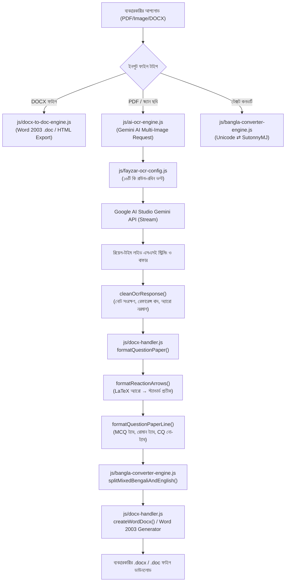

# 🧠 ENGINE_KNOWLEDGE_BASE — কোর ইঞ্জিন ডায়াগনস্টিক ও আর্কিটেকচার নির্দেশিকা

> **উদ্দেশ্য:** এই ফাইলটি ফয়জার কম্পিউটারের সকল কনভার্টার, ওসিআর, ওয়ার্ড জেনারেটর ও ব্যাকএন্ড স্ক্রিপ্টসমূহের একটি স্থায়ী "ইন-মেমোরি" আর্কিটেকচার ও দ্রুত ডায়াগনস্টিক রিপোর্ট। যেকোনো বাগ বা ফিচারের ক্ষেত্রে **পুনরায় পুরো রিপোজিটরি স্ক্যান বা এনালাইজ করার প্রয়োজন নেই**—নিচের টেবিল ও লাইন নম্বর দেখে সরাসরি ফাইল ও লাইনে কাজ করতে হবে।

---

## ⚡ ১. দ্রুত ডায়াগনস্টিক সিদ্ধান্ত সারণী (Quick Diagnostic Lookup)

| সমস্যার ধরন / উপসর্গ | সংশ্লিষ্ট ফাইল | মূল ফাংশন / ব্লক | লাইন নম্বর (আনুমানিক) | দ্রুত সমাধানের নিয়মাবলী |
| :--- | :--- | :--- | :--- | :--- |
| **DOCX to DOC কনভার্ট ক্র্যাশ** | [js/docx-to-doc-engine.js](file:///c:/Users/Admin/.gemini/antigravity-ide/scratch/fayzarcomputer-offline/js/docx-to-doc-engine.js) | `_parseRun()` | `L770-L810` | `imagesHtml` ভ্যারিয়েবলটি হাইফেন চেকের আগেই ইনিশিয়ালাইজড রাখতে হবে (TDZ এড়াতে)। |
| **Cannot read properties of undefined ('startUnifiedOcr')** | [js/ai-ocr-engine.js](file:///c:/Users/Admin/.gemini/antigravity-ide/scratch/fayzarcomputer-offline/js/ai-ocr-engine.js) | `GEMINI_PROMPT` / `global.FayzarAiOcrEngine` | `L120-L125` `L2570` | JS স্ট্রিং বা টেমপ্লেট লিটারেলে `\x` থাকলে হেক্স এস্কেপ এরর হয়। ল্যাটেক্স কমান্ডের জন্য `\\xrightarrow` এস্কেপ নিশ্চিত করতে হবে। |
| **এপিআই কি রোটেশন / কি হ্যাং** | [js/ai-ocr-engine.js](file:///c:/Users/Admin/.gemini/antigravity-ide/scratch/fayzarcomputer-offline/js/ai-ocr-engine.js) | `executeGeminiRequest()` | `L990-L1070` | ৪২৯ বা ৫০৩ রেসপন্সে ০ms বিলম্বে `continue` করে পরবর্তী কি নেবে। হ্যান্ডশেক টাইমআউট ২৫ সেকেন্ড। মডেল পরিবর্তন নিষিদ্ধ। |
| **১৬টি এপিআই কি-র তালিকা ও স্ট্যাটাস** | [js/fayzar-ocr-config.js](file:///c:/Users/Admin/.gemini/antigravity-ide/scratch/fayzarcomputer-offline/js/fayzar-ocr-config.js) | `VAULT.KEYS` / `markKeyCooldown` | `L15-L120` | XOR 42 দিয়ে এনকোডেড। কি ভ্যালিডেশন, কুলডাউন ও রাউন্ড-রবিন ডিস্ট্রিবিউশন এখান থেকে নিয়ন্ত্রিত হয়। |
| **তীর চিহ্ন এলোমেলো / [িেরমযঃধৎৎড়]** | [js/docx-handler.js](file:///c:/Users/Admin/.gemini/antigravity-ide/scratch/fayzarcomputer-offline/js/docx-handler.js) [js/bangla-converter-engine.js](file:///c:/Users/Admin/.gemini/antigravity-ide/scratch/fayzarcomputer-offline/js/bangla-converter-engine.js) | `DocxHandler.formatReactionArrows()` `splitMixedBengaliAndEnglish` | `L810-L840` `L1170-L1190` | `\xrightarrow` কে `──[...]──>` এবং `\rightarrow` কে `→`-তে রূপান্তর। টোকেনাইজারে তীর চিহ্ন ইংরেজি হিসেবে চিহ্নিত থাকে। |
| **'অ্যারিস্টটল' / 'অ্যা'-এর বানান ভুল** | [js/bangla-converter-engine.js](file:///c:/Users/Admin/.gemini/antigravity-ide/scratch/fayzarcomputer-offline/js/bangla-converter-engine.js) | `UNICODE_TO_BIJOY_CONJUNCTS` `BIJOY_TO_UNICODE_CONJUNCTS` `extractCluster()` | `L18-L25` `L414-L425` `L750-L765` | `অ্যা` $\leftrightarrow$ `A¨v` ও `অ্য` $\leftrightarrow$ `A¨` ম্যাপিং। `extractCluster`-এ আগে কনজাঙ্কট চেক করতে হবে। |
| **বহুনির্বাচনী রোমান সংখ্যায় ট্যাব মিসিং** | [js/docx-handler.js](file:///c:/Users/Admin/.gemini/antigravity-ide/scratch/fayzarcomputer-offline/js/docx-handler.js) | `formatQuestionPaperLine()` | `L775-L785` | `^[ \t]*(i{1,3}\|iv\|v)[\.\)]` প্যাটার্ন শনাক্ত করে বাধ্যতামূলকভাবে শুরুতে `\t` বসবে। |
| **সৃজনশীল প্রশ্নের ক, খ, গ, ঘ-তে অনাকাঙ্ক্ষিত ট্যাব রোধ** | [js/docx-handler.js](file:///c:/Users/Admin/.gemini/antigravity-ide/scratch/fayzarcomputer-offline/js/docx-handler.js) | `formatQuestionPaperLine()` | `L785-L815` | প্রশ্নবোধক বা ব্যাখ্যামূলক CQ লাইনে কোনো ট্যাব বসবে না (`${letter}. ${rest}`)। |
| **বহুনির্বাচনী ক/খ/গ/ঘ-তে বাধ্যতামূলক ট্যাব** | [js/docx-handler.js](file:///c:/Users/Admin/.gemini/antigravity-ide/scratch/fayzarcomputer-offline/js/docx-handler.js) | `formatQuestionPaperLine()` `formatMcqLineTabs()` | `L765-L830` `L685-L750` | বহুনির্বাচনী বিকল্পের শুরুতে (ক.) এবং মাঝে (খ., গ., ঘ.) বাধ্যতামূলক `\t` বসবে (`\tক. ২০\tখ. ৪০...`)। ফলথ্রু স্ট্রিপিং সম্পূর্ণ বন্ধ। |
| **ইংরেজি রাসায়নিক সংকেত বাংলায় অনুবাদ রোধ** | [js/ai-ocr-engine.js](file:///c:/Users/Admin/.gemini/antigravity-ide/scratch/fayzarcomputer-offline/js/ai-ocr-engine.js) | `GEMINI_PROMPT` / `GEMINI_VERIFY_PROMPT` | `L115-L135` `L180-L195` | রুল ১৪ ও রুল ১৬: $H_2O, KNO_3, KO, KOH, CO_2, NaCl$ বাধ্যতামূলক খাঁটি ইংরেজিতে থাকবে, বাংলায় রূপান্তর নিষিদ্ধ। |
| **গণিত / সমীকরণ রূপান্তর** | [js/equation-converter.js](file:///c:/Users/Admin/.gemini/antigravity-ide/scratch/fayzarcomputer-offline/js/equation-converter.js) | `latexToEqField()` `_convertSymbols()` | `L20-L85` `L265-L350` | LaTeX থেকে ওয়ার্ড EQ ফিল্ড রূপান্তর, ডিগ্রি ও প্রতীক রূপান্তর। |
| **গিটহাব ব্যাকআপ / সিঙ্ক** | [scripts/sync_to_github.py](file:///c:/Users/Admin/.gemini/antigravity-ide/scratch/fayzarcomputer-offline/scripts/sync_to_github.py) [UPDATE_TO_GITHUB.bat](file:///c:/Users/Admin/.gemini/antigravity-ide/scratch/fayzarcomputer-offline/UPDATE_TO_GITHUB.bat) | `main()` | সম্পূর্ণ ফাইল | লোকাল পরিবর্তিত ফাইল সরাসরি GitHub API দিয়ে পুশ করে। |
| **গিটহাব থেকে অফলাইন আপডেট** | [scripts/pull_from_github.py](file:///c:/Users/Admin/.gemini/antigravity-ide/scratch/fayzarcomputer-offline/scripts/pull_from_github.py) [PULL_FROM_GITHUB.bat](file:///c:/Users/Admin/.gemini/antigravity-ide/scratch/fayzarcomputer-offline/PULL_FROM_GITHUB.bat) | `main()` | সম্পূর্ণ ফাইল | GitHub থেকে zipball নামিয়ে লোকাল ফাইল আপডেট করে, লোকাল কনফিগ অক্ষত রাখে। |

---

## 🏛️ ২. কোর ইঞ্জিন আর্কিটেকচার ও পাইপলাইন মানচিত্র

---

## 🔬 ৩. গুরুত্বপূর্ণ ফাইল ও কোড স্ট্রাকচার বিশদ

### ক. `js/ai-ocr-engine.js` (সাইজ: ~১৩৯ KB)
- **`GEMINI_PROMPT` (L33-L148):** এআই-এর মূল কম্পোজিশন নিয়ম।
  - রুল ১০: বহুনির্বাচনী প্রশ্নের ফরম্যাট ও রোমান সংখ্যায় ট্যাব (`\ti.`).
  - রুল ১১: সৃজনশীল প্রশ্নের উপ-প্রশ্নে (ক., খ., গ., ঘ.) **কোনো ট্যাব থাকবে না**।
  - রুল ১৪: রাসায়নিক সমীকরণের তীর চিহ্ন ও বিজ্ঞানের সংকেত ($KNO_3, H_2O, KO, KOH$) ১০০% ইংরেজিতে রাখা।
- **`executeGeminiRequest()` (L875-L1210):** এপিআই কল এক্সিকিউটর।
  - L960-L985: ১৬টি কি-র রাউন্ড-রবিন পুল প্রস্তুতকরণ।
  - L995-L1070: **কি রোটেশন লুপ**—মডেল স্থির রেখে কি বদল, ৪২৯/৫০৩ হ্যান্ডলিং, ২৫ সেকেন্ড ফাস্ট কানেক্ট টাইমআউট।
- **`cleanOcrResponse()` (L1620-L1710):** এআই রেসপন্স পোস্ট-প্রসেসিং।
  - L1638: `DocxHandler.formatReactionArrows` কল করে সব তীর চিহ্ন নরমাল করা।
  - L1684: `formatQuestionPaperLine` দিয়ে প্রতিটি লাইনের প্রশ্ন কাঠামো সাজানো।

### খ. `js/bangla-converter-engine.js` (সাইজ: ~৪৬ KB)
- **`UNICODE_TO_BIJOY_CONJUNCTS` (L18-L120):** ২৫০+ যুক্তবর্ণ ম্যাপিং তালিকা। এখানে `অ্যা` $\rightarrow$ `A¨v` এবং `অ্য` $\rightarrow$ `A¨` শীর্ষ লাইনে ডিফাইন করা।
- **`BIJOY_TO_UNICODE_CONJUNCTS` (L414-L425):** বিজয় থেকে ইউনিকোড রিভার্স কনজাঙ্কট টেবিল। `Av¨v` ও `A¨v` $\rightarrow$ `অ্যা` নিশ্চিত করে।
- **`extractCluster()` (L750-L770):** ইউনিকোড স্ট্রিং থেকে সিলেবল ও যুক্তবর্ণ আলাদা করার ইঞ্জিন।
- **`splitMixedBengaliAndEnglish()` (L1160-L1215):** বাংলা ও ইংরেজি/ম্যাথ আলাদা করার টোকেনাইজার। কেমিক্যাল ফর্মুলা, তীর চিহ্ন (`──`, `→`, `←`, `⇄`) কে ইংরেজি ক্যাটাগরিতে রাখে যাতে ওয়ার্ডে Times New Roman প্রয়োগ হয়।

### গ. `js/docx-handler.js` (সাইজ: ~৭২ KB)
- **`formatReactionArrows()` (L810-L840):** `\xrightarrow` এবং সকল ল্যাটেক্স তীরকে ওয়ার্ড-বান্ধব স্ট্যান্ডার্ড এরোতে রূপান্তর করে।
- **`formatQuestionPaperLine()` (L760-L810):** লাইভ লাইন ফরম্যাটার।
  - রোমান সংখ্যা (`i.`, `ii.`, `iii.`) পেলে `\t` যুক্ত করে।
  - CQ উপ-প্রশ্ন (`ক.`, `খ.`, `গ.`, `ঘ.`) পেলে কোনো ট্যাব দেয় না।
- **`formatMcqLineTabs()` (L690-L755):** বহুনির্বাচনীর বহু-বিকল্প লাইনকে সুন্দর ট্যাব ফরম্যাটে সাজায়।

### ঘ. `js/docx-to-doc-engine.js` (সাইজ: ~৪৩ KB)
- **`_parseRun()` (L760-L835):** ওয়ার্ড ডকের প্রতিটি রান পার্স করে ডুয়াল-ফন্ট বাইন্ডিং (SutonnyMJ + Times New Roman) নিশ্চিত করে।
- **`_extractImagesFromNode()` (L840+):** ডকে থাকা ছবি এক্সট্র্যাক্ট করে বেস৬৪-এ কনভার্ট করে।

---

## 📌 ৪. ভবিষ্যতের জন্য নির্দেশনা (Agent Operating Rule)
যখনই কোনো সমস্যা রিপোর্ট করা হবে:
1. **প্রথমে এই ফাইল (`ENGINE_KNOWLEDGE_BASE.md`) দেখুন।**
2. সারণী থেকে নির্দিষ্ট ফাইল ও লাইন নম্বর নিন।
3. সম্পূর্ণ রিপোজিটরি স্ক্যান বা একের পর এক ফাইল পড়ার বদলে সরাসরি নির্দিষ্ট ফাইল ও লাইনে সার্জিক্যাল ডিআইএফএফ (Minimal Edit) করুন।
