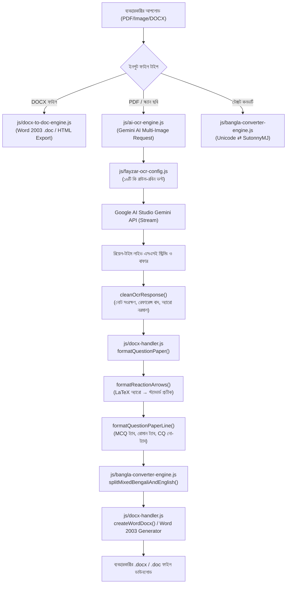

# 🧠 ENGINE_KNOWLEDGE_BASE — কোর ইঞ্জিন ডায়াগনস্টিক ও আর্কিটেকচার নির্দেশিকা

> **উদ্দেশ্য:** এই ফাইলটি ফয়জার কম্পিউটারের সকল কনভার্টার, ওসিআর, ওয়ার্ড জেনারেটর ও ব্যাকএন্ড স্ক্রিপ্টসমূহের একটি স্থায়ী "ইন-মেমোরি" আর্কিটেকচার ও দ্রুত ডায়াগনস্টিক রিপোর্ট। যেকোনো বাগ বা ফিচারের ক্ষেত্রে **পুনরায় পুরো রিপোজিটরি স্ক্যান বা এনালাইজ করার প্রয়োজন নেই**—নিচের টেবিল ও লাইন নম্বর দেখে সরাসরি ফাইল ও লাইনে কাজ করতে হবে।

---

## ⚡ ১. দ্রুত ডায়াগনস্টিক সিদ্ধান্ত সারণী (Quick Diagnostic Lookup)

| সমস্যার ধরন / উপসর্গ | সংশ্লিষ্ট ফাইল | মূল ফাংশন / ব্লক | লাইন নম্বর (আনুমানিক) | দ্রুত সমাধানের নিয়মাবলী |
| :--- | :--- | :--- | :--- | :--- |
| **DOCX to DOC কনভার্ট ক্র্যাশ** | [js/docx-to-doc-engine.js](file:///c:/Users/Admin/.gemini/antigravity-ide/scratch/fayzarcomputer-offline/js/docx-to-doc-engine.js) | `_parseRun()` | `L770-L810` | `imagesHtml` ভ্যারিয়েবলটি হাইফেন চেকের আগেই ইনিশিয়ালাইজড রাখতে হবে (TDZ এড়াতে)। |
| **Cannot read properties of undefined ('startUnifiedOcr')** | [js/ai-ocr-engine.js](file:///c:/Users/Admin/.gemini/antigravity-ide/scratch/fayzarcomputer-offline/js/ai-ocr-engine.js) | `GEMINI_PROMPT` / `global.FayzarAiOcrEngine` | `L120-L125` `L2570` | JS স্ট্রিং বা টেমপ্লেট লিটারেলে `\x` থাকলে হেক্স এস্কেপ এরর হয়। ল্যাটেক্স কমান্ডের জন্য `\\xrightarrow` এস্কেপ নিশ্চিত করতে হবে। |
| **এপিআই কি রোটেশন / কি হ্যাং ও গতি নিশ্চিতকরণ** | [js/ai-ocr-engine.js](file:///c:/Users/Admin/.gemini/antigravity-ide/scratch/fayzarcomputer-offline/js/ai-ocr-engine.js) [js/fayzar-ocr-config.js](file:///c:/Users/Admin/.gemini/antigravity-ide/scratch/fayzarcomputer-offline/js/fayzar-ocr-config.js) | `executeGeminiRequest()` `getRotatedSystemKeys()` | `L1015-L1050` `L180-L215` | কোনো স্ট্যাটিক কি প্রথমে ফিক্সড থাকবে না। প্রতি রিকোয়েস্টে ১৯টি ভল্ট কি থেকে ক্রমানুসারে পরবর্তী নতুন ফ্রেশ কি প্রথমে রেখে রিকুয়েস্ট শুরু হয়; ৪২৯/৫0৩ বা এররে ০ms বিলম্বে কি শিফট হয়। |
| **১৬টি এপিআই কি-র তালিকা ও স্ট্যাটাস** | [js/fayzar-ocr-config.js](file:///c:/Users/Admin/.gemini/antigravity-ide/scratch/fayzarcomputer-offline/js/fayzar-ocr-config.js) | `VAULT.KEYS` / `markKeyCooldown` | `L15-L120` | XOR 42 দিয়ে এনকোডেড। কি ভ্যালিডেশন, কুলডাউন ও রাউন্ড-রবিন ডিস্ট্রিবিউশন এখান থেকে নিয়ন্ত্রিত হয়। |
| **তীর চিহ্ন এলোমেলো / [িেরমযঃধৎৎড়]** | [js/docx-handler.js](file:///c:/Users/Admin/.gemini/antigravity-ide/scratch/fayzarcomputer-offline/js/docx-handler.js) [js/bangla-converter-engine.js](file:///c:/Users/Admin/.gemini/antigravity-ide/scratch/fayzarcomputer-offline/js/bangla-converter-engine.js) | `DocxHandler.formatReactionArrows()` `splitMixedBengaliAndEnglish` | `L840-L870` `L1170-L1190` | `\xrightarrow` কে স্ট্যান্ডার্ড তীর `→` (প্রভাবক থাকলে `→ (প্রভাবক)`) রূপান্তর। |
| **'অ্যারিস্টটল' / 'অ্যা' ও 'ন্ত্র'-এর বানান** | [js/bangla-converter-engine.js](file:///c:/Users/Admin/.gemini/antigravity-ide/scratch/fayzarcomputer-offline/js/bangla-converter-engine.js) | `UNICODE_TO_BIJOY_CONJUNCTS` `BIJOY_TO_UNICODE_CONJUNCTS` `extractCluster()` | `L18-L30` `L414-L430` `L750-L765` | `অ্যা` $\leftrightarrow$ `A¨v` ও `ন্ত্র` $\leftrightarrow$ `š¿` ম্যাপিং। 'স্বরযন্ত্রে' বা 'যন্ত্র' আর ভাঙবে না। |
| **বহুনির্বাচনী রোমান সংখ্যায় ট্যাব মিসিং** | [js/docx-handler.js](file:///c:/Users/Admin/.gemini/antigravity-ide/scratch/fayzarcomputer-offline/js/docx-handler.js) | `formatQuestionPaperLine()` | `L775-L785` | `^[ \t]*(i{1,3}\|iv\|v)[\.\)]` প্যাটার্ন শনাক্ত করে বাধ্যতামূলকভাবে শুরুতে `\t` বসবে। |
| **সৃজনশীল প্রশ্নের ক, খ, গ, ঘ-তে অনাকাঙ্ক্ষিত ট্যাব রোধ** | [js/docx-handler.js](file:///c:/Users/Admin/.gemini/antigravity-ide/scratch/fayzarcomputer-offline/js/docx-handler.js) | `formatQuestionPaperLine()` | `L785-L815` | প্রশ্নবোধক বা ব্যাখ্যামূলক CQ লাইনে কোনো ট্যাব বসবে না (`${letter}. ${rest}`)। |
| **বহুনির্বাচনী ক/খ/গ/ঘ-তে বাধ্যতামূলক ট্যাব** | [js/docx-handler.js](file:///c:/Users/Admin/.gemini/antigravity-ide/scratch/fayzarcomputer-offline/js/docx-handler.js) | `formatQuestionPaperLine()` `formatMcqLineTabs()` | `L765-L830` `L685-L750` | বহুনির্বাচনী বিকল্পের শুরুতে (ক.) এবং মাঝে (খ., গ., ঘ.) বাধ্যতামূলক `\t` বসবে (`\tক. ২০\tখ. ৪০...`)। ফলথ্রু স্ট্রিপিং সম্পূর্ণ বন্ধ। |
| **ইংরেজি রাসায়নিক সংকেত বাংলায় অনুবাদ রোধ** | [js/ai-ocr-engine.js](file:///c:/Users/Admin/.gemini/antigravity-ide/scratch/fayzarcomputer-offline/js/ai-ocr-engine.js) | `cleanOcrResponse()` `GEMINI_PROMPT` | `L1645-L1660` `L120-L135` | বিজয় কিবোর্ডের টাইপিং ভুলে 'KO'->'কও', 'KOH'->'কঘ', '2H2O'->'২ঐও' এলে তা স্বয়ংক্রিয়ভাবে আসল ইংরেজি সংকেতে কারেকশন। |
| **টেক্সট প্রিভিউ না দেখানো** | [js/ai-ocr-engine.js](file:///c:/Users/Admin/.gemini/antigravity-ide/scratch/fayzarcomputer-offline/js/ai-ocr-engine.js) [js/main.js](file:///c:/Users/Admin/.gemini/antigravity-ide/scratch/fayzarcomputer-offline/js/main.js) | `togglePreviewBtn` `wizardPreviewToggleBtn` | `L408-L425` `L2933` | ডুপ্লিকেট ইভেন্ট লিসেনার কনফ্লিক্ট দূর করা হয়েছে এবং টেক্সট বক্সে রেজাল্ট পপুলেট নিশ্চিত করা হয়েছে। |
| **ইংরেজি সংখ্যা বনাম বাংলা সংখ্যা ফন্ট সুরক্ষা** | [js/bangla-converter-engine.js](file:///c:/Users/Admin/.gemini/antigravity-ide/scratch/fayzarcomputer-offline/js/bangla-converter-engine.js) [js/main.js](file:///c:/Users/Admin/.gemini/antigravity-ide/scratch/fayzarcomputer-offline/js/main.js) | `splitMixedBengaliAndEnglish()` | `L1180-L1220` `L3298-L3324` | জিমিনি থেকে আসা ইংরেজি সংখ্যা (`0-9`) টাইমস নিউ রোমানে অক্ষত থাকে; এবং ইউনিকোড বাংলা সংখ্যা (`০-৯`) যথারীতি বিজয়ে (সুতন্নীএমজে) রূপান্তরিত হয়। |
| **গণিত / সমীকরণ রূপান্তর** | [js/equation-converter.js](file:///c:/Users/Admin/.gemini/antigravity-ide/scratch/fayzarcomputer-offline/js/equation-converter.js) | `latexToEqField()` `_convertSymbols()` | `L20-L85` `L265-L350` | LaTeX থেকে ওয়ার্ড EQ ফিল্ড রূপান্তর, ডিগ্রি ও প্রতীক রূপান্তর। |
| **ডকুমেন্ট কনভার্ট শেষে পুনরায় প্রসেসিং এ ফিরে যাওয়া রোধ** | [js/ai-ocr-engine.js](file:///c:/Users/Admin/.gemini/antigravity-ide/scratch/fayzarcomputer-offline/js/ai-ocr-engine.js) | `startUnifiedOcr()` `startOcrConversion()` | `L420-L425` `L765-L845` | `executeAiConversionBtn`-এ ডুপ্লিকেট লিসেনার বাদ দেওয়া, `state.isProcessing` লক এবং অটো-ভেরিফাই একবারে সম্পন্ন করে ফাইনাল রেজাল্ট প্রকাশ। |
| **রাসায়নিক সংকেতে সাবস্ক্রিপ্ট ও MCQ অপশন ট্যাব** | [js/docx-handler.js](file:///c:/Users/Admin/.gemini/antigravity-ide/scratch/fayzarcomputer-offline/js/docx-handler.js) | `formatMcqLineTabs()` `createDocFromText()` | `L705-L725` `L1175-L1190` | $\text{KNO}_2, \text{KNO}_3, \text{H}_2\text{O}, \text{H}_2\text{O}_2$ সংকেতে সঠিক সাবস্ক্রিপ্ট এবং স্পেস-যুক্ত বা কনক্যাট অপশনে বাধ্যতামূলক `\t` নিশ্চিতকরণ। |
| **গিটহাব ব্যাকআপ / সিঙ্ক** | [scripts/sync_to_github.py](file:///c:/Users/Admin/.gemini/antigravity-ide/scratch/fayzarcomputer-offline/scripts/sync_to_github.py) [UPDATE_TO_GITHUB.bat](file:///c:/Users/Admin/.gemini/antigravity-ide/scratch/fayzarcomputer-offline/UPDATE_TO_GITHUB.bat) | `main()` | সম্পূর্ণ ফাইল | লোকাল পরিবর্তিত ফাইল সরাসরি GitHub API দিয়ে পুশ করে। |
| **গিটহাব থেকে অফলাইন আপডেট** | [scripts/pull_from_github.py](file:///c:/Users/Admin/.gemini/antigravity-ide/scratch/fayzarcomputer-offline/scripts/pull_from_github.py) [PULL_FROM_GITHUB.bat](file:///c:/Users/Admin/.gemini/antigravity-ide/scratch/fayzarcomputer-offline/PULL_FROM_GITHUB.bat) | `main()` | সম্পূর্ণ ফাইল | GitHub থেকে zipball নামিয়ে লোকাল ফাইল আপডেট করে, লোকাল কনফিগ অক্ষত রাখে। |

---

## 🏛️ ২. কোর ইঞ্জিন আর্কিটেকচার ও পাইপলাইন মানচিত্র

---

## 🔬 ৩. গুরুত্বপূর্ণ ফাইল ও কোড স্ট্রাকচার বিশদ

### ক. `js/ai-ocr-engine.js` (সাইজ: ~১৩৯ KB)
- **`GEMINI_PROMPT` (L33-L148):** এআই-এর মূল কম্পোজিশন নিয়ম।
  - রুল ২: সার্বজনীন স্ক্রিপ্ট ও ভাষা অবিকল সংরক্ষণ (Universal Script & Language Fidelity) — সৃজনশীল উদ্দীপক, উপ-প্রশ্ন (ক., খ., গ., ঘ.), বহুনির্বাচনী বা সাধারণ প্রশ্ন—যেকোনো কাজের ক্ষেত্রে মূল ডকুমেন্টে যেখানেই ইংরেজি শব্দ, সংকেত, প্রতীক বা সংখ্যা (`A, B, C, Cu, FeCl3, 20, 4, 6` বা অপশনে `1, 2, 9, 10`) রয়েছে, তা বাধ্যতামূলকভাবে খাঁটি ইংরেজিতে (ASCII English) আউটপুট দিতে হবে; কোনো অবস্থাতেই বাংলায় রূপান্তর নিষিদ্ধ।
  - রুল ১০: বহুনির্বাচনী প্রশ্নের ফরম্যাট, রোমান সংখ্যায় ট্যাব (`\ti.`) ও অপশনে ইংরেজি সংখ্যার অবিকল রূপ সংরক্ষণ।
  - রুল ১১: সৃজনশীল প্রশ্নের উপ-প্রশ্নে (ক., খ., গ., ঘ.) **কোনো ট্যাব থাকবে না**।
  - রুল ১৪: রাসায়নিক সমীকরণের তীর চিহ্ন ও বিজ্ঞানের সংকেত ($KNO_3, H_2O, KO, KOH$) ১০০% ইংরেজিতে রাখা; মূল ফাইলের সংখ্যা ও একক পুঙ্খানুপুঙ্খ যাচাই, '8' বনাম '৮' বিভ্রান্তি রোধ এবং বৈজ্ঞানিক MCQ অপশনে একরূপ ইংরেজি সংখ্যা নিশ্চিতকরণ।
- **`executeGeminiRequest()` (L875-L1210):** এপিআই কল এক্সিকিউটর।
  - L928: ডিফল্ট ফ্ল্যাগশিপ মডেল হিসেবে ব্যবহারকারীর পছন্দের স্থিতিশীল `gemini-3.5-flash` শীর্ষ স্থানে রাখা (ব্যাকআপে `gemini-2.5-flash` ১.৩ সেকেন্ড)।
  - L965-L990: ১৯টি কি-র LRU রাউন্ড-রবিন পুল প্রস্তুতকরণ (নতুন ৩টি কি যুক্ত, ডুপ্লিকেটমুক্ত)।
  - L1021: **৫.০ সেকেন্ড ফাস্ট কানেক্ট টাইমআউট** এবং **৮.০ সেকেন্ড স্ট্রিমিং আইডল টাইমআউট**—সার্ভার হ্যাং এড়াতে তাৎক্ষণিক রোটেশন।
  - L1035-L1082: ৪২৯ কোটা শেষ হলে ৬০ সেকেন্ড সেশন কুলডাউন (পরের বার ০ms-এ স্কিপ)।
  - স্ক্রিন মেসেজ ক্লিন ও প্রফেশনাল রাখা এবং `FayzarOcrConfig.logAudit()` দিয়ে ব্যাকগ্রাউন্ড অডিট লগ সংরক্ষণ।
  - L1680: `cleanOcrResponse()`-এ হাইব্রিড মিশ্র সংখ্যা অটো-হিলিং (যেমন: `8.8৮ L` $\to$ `8.88 L`)।
  - L1638: `DocxHandler.formatReactionArrows` কল করে সব তীর চিহ্ন নরমাল করা।
  - L1684: `formatQuestionPaperLine` দিয়ে প্রতিটি লাইনের প্রশ্ন কাঠামো সাজানো।

### খ. `js/bangla-converter-engine.js` (সাইজ: ~৪৬ KB)
- **`UNICODE_TO_BIJOY_CONJUNCTS` (L18-L120):** ২৫০+ যুক্তবর্ণ ম্যাপিং তালিকা। এখানে `অ্যা` $\rightarrow$ `A¨v` এবং `অ্য` $\rightarrow$ `A¨` শীর্ষ লাইনে ডিফাইন করা।
- **`BIJOY_TO_UNICODE_CONJUNCTS` (L414-L425):** বিজয় থেকে ইউনিকোড রিভার্স কনজাঙ্কট টেবিল। `Av¨v` ও `A¨v` $\rightarrow$ `অ্যা` নিশ্চিত করে।
- **`extractCluster()` (L750-L770):** ইউনিকোড স্ট্রিং থেকে সিলেবল ও যুক্তবর্ণ আলাদা করার ইঞ্জিন।
- **`splitMixedBengaliAndEnglish()` (L1160-L1215):** বাংলা ও ইংরেজি/ম্যাথ আলাদা করার টোকেনাইজার। কেমিক্যাল ফর্মুলা, তীর চিহ্ন (`──`, `→`, `←`, `⇄`) কে ইংরেজি ক্যাটাগরিতে রাখে যাতে ওয়ার্ডে Times New Roman প্রয়োগ হয়।

### গ. `js/docx-handler.js` (সাইজ: ~৭২ KB)
- **`formatReactionArrows()` (L810-L840):** `\xrightarrow` এবং সকল ল্যাটেক্স তীরকে ওয়ার্ড-বান্ধব স্ট্যান্ডার্ড এরোতে রূপান্তর করে।
- **`formatQuestionPaperLine()` (L760-L810):** লাইভ লাইন ফরম্যাটার।
  - রোমান সংখ্যা (`i.`, `ii.`, `iii.`) পেলে `\t` যুক্ত করে।
  - CQ উপ-প্রশ্ন (`ক.`, `খ.`, `গ.`, `ঘ.`) পেলে কোনো ট্যাব দেয় না।
- **`formatMcqLineTabs()` (L690-L755):** বহুনির্বাচনীর বহু-বিকল্প লাইনকে সুন্দর ট্যাব ফরম্যাটে সাজায়।
- **`createDocFromText()` & `createDocxBlob()`:** শুধুমাত্র খাঁটি ইউনিকোড বাংলা অংশ বিজয়ে (SutonnyMJ) রূপান্তর হয়; রোমান সংখ্যা (`i.`, `ii.`, `iii.`), রাসায়নিক সংকেত (`HF`, `H2O`, `CH3CH2OH`, `C2H4`), একক এবং ইংরেজি টেক্সট ১০০% Times New Roman ফন্টে সংরক্ষিত থাকে।

### ঘ. `js/docx-to-doc-engine.js` (সাইজ: ~৪৩ KB)
- **`_parseRun()` (L760-L835):** ওয়ার্ড ডকের প্রতিটি রান পার্স করে ডুয়াল-ফন্ট বাইন্ডিং (SutonnyMJ + Times New Roman) নিশ্চিত করে।
- **`_extractImagesFromNode()` (L840+):** ডকে থাকা ছবি এক্সট্র্যাক্ট করে বেস৬৪-এ কনভার্ট করে।

---

## 📌 ৪. ভবিষ্যতের জন্য নির্দেশনা (Agent Operating Rule)
যখনই কোনো সমস্যা রিপোর্ট করা হবে:
1. **প্রথমে এই ফাইল (`ENGINE_KNOWLEDGE_BASE.md`) দেখুন।**
2. সারণী থেকে নির্দিষ্ট ফাইল ও লাইন নম্বর নিন।
3. সম্পূর্ণ রিপোজিটরি স্ক্যান বা একের পর এক ফাইল পড়ার বদলে সরাসরি নির্দিষ্ট ফাইল ও লাইনে সার্জিক্যাল ডিআইএফএফ (Minimal Edit) করুন।
